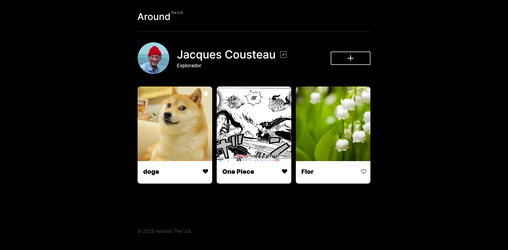

# 🗺️ Around The U.S. — Galería Interactiva


Aplicación web interactiva que permite crear y gestionar una galería de tarjetas con imágenes de lugares favoritos. Integra una **API REST** para sincronizar todos los datos con un servidor remoto: perfil de usuario, tarjetas y likes.

🔗 **[Ver proyecto en vivo](https://diego-caceres-s.github.io/web_project_around_es/)**

---

## 📸 Vista previa

> 

---

## ✨ Funcionalidades

| Funcionalidad          | Descripción                                                            |
| ---------------------- | ---------------------------------------------------------------------- |
| 🖼️ Galería de tarjetas | Visualización de tarjetas con imágenes cargadas desde el servidor      |
| ➕ Agregar tarjetas    | Formulario para crear nuevas tarjetas, guardadas en el servidor        |
| ❤️ Me gusta            | Marca tarjetas favoritas, sincronizado con el servidor                 |
| 🗑️ Eliminar tarjetas   | Popup de confirmación antes de borrar en el servidor                   |
| 🔍 Vista ampliada      | Modal para ver imágenes en tamaño completo                             |
| ✏️ Editar perfil       | Modifica nombre y descripción del usuario, guardado en el servidor     |
| 🖼️ Cambiar avatar      | Actualiza la foto de perfil desde un enlace de imagen                  |
| ✅ Validación          | Validación en tiempo real de formularios con mensajes de error         |
| ⏳ Estado de carga     | Botones muestran "Guardando..." mientras espera respuesta del servidor |
| ⌨️ Cierre de modales   | Con tecla `Esc` o clic en el overlay                                   |
| 📱 Responsivo          | Adaptable a distintos tamaños de pantalla                              |

---

## 🛠️ Tecnologías utilizadas

- **HTML5** — Estructura semántica y templates
- **CSS3** — Estilos, diseño responsivo y metodología BEM
- **JavaScript ES6** — Clases, módulos, promesas y manipulación del DOM
- **Fetch API** — Comunicación asíncrona con el servidor
- **API REST** — Integración con servidor remoto para persistencia de datos
- **Git & GitHub** — Control de versiones y despliegue

---

## 🔌 Integración con la API

Todas las operaciones de datos se sincronizan con el servidor remoto:

| Método   | Endpoint           | Descripción                            |
| -------- | ------------------ | -------------------------------------- |
| `GET`    | `/users/me`        | Carga el perfil del usuario al iniciar |
| `GET`    | `/cards`           | Carga las tarjetas iniciales           |
| `PATCH`  | `/users/me`        | Guarda los cambios del perfil          |
| `PATCH`  | `/users/me/avatar` | Actualiza la foto de perfil            |
| `POST`   | `/cards`           | Crea una nueva tarjeta                 |
| `DELETE` | `/cards/:id`       | Elimina una tarjeta                    |
| `PUT`    | `/cards/:id/likes` | Da "me gusta" a una tarjeta            |
| `DELETE` | `/cards/:id/likes` | Quita el "me gusta"                    |

---

## 🗂️ Arquitectura JavaScript

El proyecto utiliza programación orientada a objetos con clases ES6:

```
scripts/
├── index.js                  → Punto de entrada, inicialización general
├── Api.js                    → Clase para todas las llamadas a la API REST
├── Card.js                   → Clase para crear y gestionar tarjetas
├── FormValidator.js          → Clase para validación de formularios
├── Popup.js                  → Clase base para ventanas emergentes
├── PopupWithConfirmation.js  → Popup de confirmación para eliminar
├── PopupWithForm.js          → Popup con formulario
├── PopupWithImage.js         → Popup para vista ampliada de imagen
└── utils.js                  → Funciones utilitarias compartidas
```

---

## 📁 Estructura del proyecto

```
web_project_around_es/
├── index.html
├── blocks/
│   ├── card.css
│   ├── cards.css
│   ├── content.css
│   ├── footer.css
│   ├── header.css
│   ├── page.css
│   ├── popup.css
│   └── profile.css
├── images/
│   ├── add-icon.svg
│   ├── avatar.jpg
│   ├── close.svg
│   ├── delete-icon.svg
│   ├── edit-icon.svg
│   ├── like-active.svg
│   ├── like-inactive.svg
│   └── logo.svg
├── pages/
│   └── index.css
├── scripts/
│   ├── index.js
│   ├── Api.js
│   ├── Card.js
│   ├── FormValidator.js
│   ├── Popup.js
│   ├── PopupWithConfirmation.js
│   ├── PopupWithForm.js
│   ├── PopupWithImage.js
│   └── utils.js
└── vendor/
    ├── fonts/
    │   ├── Inter-Black.woff2
    │   ├── Inter-Medium.woff2
    │   └── Inter-Regular.woff2
    ├── fonts.css
    └── normalize.css
```

---

## 🚀 Cómo ejecutar localmente

1. Clona el repositorio:

   ```bash
   git clone https://github.com/Diego-Caceres-S/web_project_around_es.git
   ```

2. Entra a la carpeta:

   ```bash
   cd web_project_around_es
   ```

3. Abre `index.html` en tu navegador o usa **Live Server** en VS Code.

> No requiere instalación de dependencias. La app se conecta directamente a la API remota.

---

## 👨‍💻 Autor

**Diego C. Cáceres S.**

- GitHub: [@Diego-Caceres-S](https://github.com/Diego-Caceres-S)
- LinkedIn: [diego-caceres-sanhueza](https://www.linkedin.com/in/diego-caceres-sanhueza/)

---

_Proyecto desarrollado para el bootcamp de desarrollo web Full-Stack de TripleTen._
